> From: https://gemini.google.com/app/359edd28872d6a96

# you asked

message time: 2026-01-30 00:10:01

Wie koennte eine komplexe Zustandsmaschine mit mehreren Startpunkten und gemeinsamen Beruerungspunken in Java aussehen?

---

# gemini response

Die Modellierung einer komplexen Zustandsmaschine (State Machine) in Java erfordert ein Gleichgewicht zwischen Flexibilität und Typsicherheit. Wenn Sie mehrere Einstiegspunkte und gemeinsame Pfade haben, ist das **State Pattern** in Kombination mit einer **zentralen Kontext-Klasse** meist die sauberste Lösung.

Hier ist ein Entwurf, der zeigt, wie man diese Struktur effizient umsetzt.

-----

## 1\. Das Konzept: Strategie & Struktur

Anstatt eines riesigen `switch-case`-Blocks nutzen wir Polymorphie. Jeder Zustand ist eine eigene Klasse (oder ein Enum-Eintrag mit Logik), und der Übergang erfolgt über ein gemeinsames Interface.

### Die Kernkomponenten:

  * **Context:** Hält den aktuellen Zustand und geteilte Daten.
  * **State Interface:** Definiert die möglichen Aktionen.
  * **Concrete States:** Implementieren die Logik für spezifische Zustände.

-----

## 2\. Implementierung des State Patterns

### Das Interface

Hier definieren wir alle Aktionen, die einen Zustandswechsel auslösen könnten.

```java
public interface State {
    void handleActionA(Context context);
    void handleActionB(Context context);
    // Gemeinsamer Berührungspunkt für viele Zustände
    void finalizeProcess(Context context); 
}
```

### Der Kontext (Die Schaltzentrale)

Der Kontext erlaubt es uns, die Maschine an **verschiedenen Startpunkten** zu initialisieren.

```java
public class Context {
    private State currentState;
    private Map<String, Object> sharedData = new HashMap<>();

    public Context(State initialState) {
        this.currentState = initialState;
    }

    public void setState(State state) {
        this.currentState = state;
    }

    public void requestA() { currentState.handleActionA(this); }
    public void requestB() { currentState.handleActionB(this); }
    public void finish() { currentState.finalizeProcess(this); }
}
```

-----

## 3\. Umgang mit mehreren Startpunkten & gemeinsamen Pfaden

### Mehrere Startpunkte

Sie können die Maschine einfach mit unterschiedlichen Implementierungen starten:

  * `new Context(new InitialGuestState())`
  * `new Context(new InitialAdminState())`

### Gemeinsame Berührungspunkte (Shared Paths)

Um Code-Duplizierung zu vermeiden, nutzen wir eine **abstrakte Basisklasse** (`BaseState`), die Standardverhalten oder gemeinsame Pfade implementiert.

```java
public abstract class BaseState implements State {
    @Override
    public void finalizeProcess(Context context) {
        // Gemeinsame Logik für alle Zustände, die diesen Pfad erreichen
        System.out.println("Bereinige Ressourcen und schließe ab...");
        context.setState(new FinishedState());
    }

    // Default: Aktion nicht erlaubt
    @Override public void handleActionA(Context context) { /* Ignorieren oder Exception */ }
    @Override public void handleActionB(Context context) { /* Ignorieren oder Exception */ }
}
```

-----

## 4\. Beispiel für einen konkreten Ablauf

| Zustand | Aktion A | Aktion B | Finalize |
| :--- | :--- | :--- | :--- |
| **StartState1** | -\> StateX | - | -\> FinalState |
| **StartState2** | - | -\> StateX | -\> FinalState |
| **StateX** | - | - | -\> FinalState |

In diesem Modell führen sowohl unterschiedliche Startpunkte als auch Zwischenzustände irgendwann zum gemeinsamen `FinalState`.

-----

## Warum dieser Ansatz?

  * **Erweiterbarkeit:** Neue Zustände sind einfach neue Klassen, ohne bestehenden Code zu zerschießen.
  * **Wartbarkeit:** Die Logik für "Was passiert in Zustand X" steht genau in `StateX.java`.
  * **Flexibilität:** Durch die Übergabe des `Context` in die Methoden können Zustände Daten lesen und schreiben (Shared Memory).

> **Pro-Tipp:** Wenn die Zustandsmaschine extrem komplex wird (Hunderte Zustände), lohnt sich ein Blick auf Bibliotheken wie **Spring State Machine** oder **Akka FSM**. Für die meisten In-App-Logiken ist das obige Pattern jedoch performanter und leichter zu debuggen.

Möchten Sie, dass ich ein konkretes Code-Beispiel für einen speziellen Anwendungsfall (z.B. ein Bestellsystem oder eine Benutzerregistrierung) erstelle?

---

# you asked

message time: 2026-01-30 00:13:48

Lass uns erstmal ueber Modelle reden, wie ma am besten sowas planen kann und dabei erkennt, wo es probleme geben koennte, waehrend dere Sustanduebergaenge. Danke dir.

---

# gemini response

Das ist ein kluger Ansatz. Bevor die erste Zeile Code geschrieben wird, ist die Modellierung entscheidend, denn bei komplexen Zustandsmaschinen (FSMs) liegt der Teufel oft im Detail – besonders bei den Übergängen und "verwaisten" Zuständen.

Hier sind die besten Methoden, um solche Systeme zu planen und potenzielle Stolperfallen frühzeitig zu erkennen:

---

## 1. Visuelle Modellierung (Der "State Chart" Ansatz)

Verwenden Sie keine einfachen Flussdiagramme, sondern **UML State Charts** (Harel Statecharts). Diese unterscheiden sich durch drei wesentliche Konzepte:

* **Hierarchische Zustände (Composite States):** Wenn mehrere Zustände dieselben Übergänge teilen (deine "Berührungspunkte"), gruppiere sie in einem Super-Zustand. Wenn der Super-Zustand einen Übergang zum "Error"-Zustand hat, gilt das automatisch für alle Unterzustände.
* **Orthogonale Regionen (Parallelität):** Kann das System in zwei Zuständen gleichzeitig sein? (z.B. "Heizung AN" UND "Timer LÄUFT"). Wenn ja, plane diese als parallele Pfade, um eine Explosion der Zustandsanzahl zu vermeiden.
* **History States:** Wenn ein System nach einer Unterbrechung (z.B. Standby) zum exakt letzten Unterzustand zurückkehren soll.

---

## 2. Die Zustandsübergangstabelle (State Transition Table)

Das ist das mächtigste Werkzeug, um Logikfehler zu finden. Erstellen Sie eine Matrix:

| Aktueller Zustand \ Event | Event A | Event B | Timeout |
| :--- | :--- | :--- | :--- |
| **Initial_A** | -> State_X | - (Ignorieren?) | -> Error |
| **Initial_B** | - (Fehler!) | -> State_X | - |
| **Common_Path** | ... | ... | ... |

**Warum das hilft:**
In einer Zeichnung vergisst man leicht einen Pfeil. In einer Tabelle siehst du sofort **leere Zellen**. 
* *Frage:* Was passiert, wenn in `Initial_B` plötzlich `Event A` eintrifft? 
* *Lösung:* Entweder explizit verbieten, ignorieren oder einen globalen Fehlerzustand definieren.

---

## 3. Typische Problemzonen erkennen

Bei der Planung solltest du auf folgende "Red Flags" achten:

### A. Race Conditions bei Übergängen
Wenn zwei Events fast gleichzeitig eintreffen: Welches gewinnt? 
* **Problem:** Ein Event triggert den Übergang von A nach B, während ein zweites Event noch denkt, wir seien in A.
* **Planung:** Definiere eine **Queue** für Events oder lege Prioritäten fest.

### B. "State Explosion"
Wenn du 5 Zustände hast und 5 mögliche Events, landest du theoretisch bei $5 \times 5 = 25$ Übergängen. 
* **Lösung:** Nutze "Guards" (Bedingungen). Ein Übergang findet nur statt, wenn `Event A` eintrifft **UND** `Bedingung X` wahr ist. Das hält die Anzahl der Zustände klein.

### C. Der "Point of no Return" (Deadlocks)
Gibt es Pfade, aus denen man nie wieder zum Hauptmenü oder zum Start zurückkommt, ohne das System neu zu starten?
* **Check:** Prüfe, ob von jedem Zustand aus ein Pfad zum "Reset" oder "Finalize" existiert.

### D. Unvollständige Start-Konfigurationen
Da du **mehrere Startpunkte** hast: 
* **Gefahr:** Startpunkt B überspringt eine Initialisierung, die später im gemeinsamen Pfad (Common Path) vorausgesetzt wird (z.B. eine geladene User-ID).
* **Check:** Erstelle eine Liste der "Voraussetzungen" für den gemeinsamen Pfad und stelle sicher, dass jeder Startpunkt diese erfüllt.

---

## 4. Strategie zur Validierung

Bevor du Java-Klassen schreibst, kannst du das Modell "trockenschwimmen":

1.  **Walkthroughs:** Gehe mit einem "Token" (einer Münze) auf deinem Diagramm alle Pfade durch.
2.  **Boundary Testing:** Was passiert bei extremen Inputs an den Berührungspunkten?
3.  **Zustands-Inventur:** Hat jeder Zustand eine Exit-Strategie (Timeout oder Abbruch)?

---

**Wie sieht dein konkretes Szenario aus?** Wenn du mir grob beschreibst, welche Startpunkte und gemeinsamen Ziele du hast, können wir mal eine beispielhafte **Übergangstabelle** aufstellen und die kritischen Stellen markieren.

---

# you asked

message time: 2026-01-30 00:16:41

Ok um ewas zu konkretisieren es geht um die Verbeitung von MausEvents und wasrscheinlichauch KeyEvents in JavaFX.

---

# gemini response

Das ist ein hervorragendes Beispiel, denn UI-Interaktionen sind von Natur aus **asynchron, unvorhersehbar** und oft **kontextabhängig**. In JavaFX können Maus-Events je nach Tastenkombination (Shift, Strg) oder Klick-Sequenz (Drag vs. Click) völlig unterschiedliche Bedeutungen haben.

Hier ist die Analyse der Modellierung für diesen spezifischen Fall:

---

## 1. Die Hierarchie der Zustände (State Tree)
In der UI-Logik ist es oft hilfreich, Zustände hierarchisch zu denken, um die "gemeinsamen Berührungspunkte" sauber zu trennen.

* **Top-Level: `IDLE`** (Warten auf Input)
* **Startpunkt A: `MOUSE_PRESSED`** (Linksklick)
    * *Unterzustand:* `POTENTIAL_DRAG` (Maus bewegt sich nach Klick)
    * *Unterzustand:* `STILL_CLICK` (Warten auf Release für "Click"-Event)
* **Startpunkt B: `KEY_PRESSED`** (z.B. Leertaste für Panning-Modus)
    * *Unterzustand:* `KEY_NAVIGATION`
* **Gemeinsamer Berührungspunkt: `INTERACTION_COMPLETE`**
    * Hier fließen alle Aktionen zusammen (UI-Update, Datenbank-Sync, Undo-History).

---

## 2. Die Planung mittels "Event-Condition-Action" (ECA)
Bei UI-Events ist die Gefahr der **State Explosion** riesig. Du solltest daher in deinem Modell streng zwischen **Events** (Input) und **Guards** (Bedingungen) trennen.

### Beispiel-Matrix für Übergänge:

| Aktueller Zustand | Event | Guard (Bedingung) | Ziel-Zustand | Aktion |
| :--- | :--- | :--- | :--- | :--- |
| `IDLE` | `MOUSE_PRESSED` | Links-Klick | `SELECTING` | Selektion hervorheben |
| `IDLE` | `MOUSE_PRESSED` | Strg + Links | `MULTI_SELECT` | - |
| `SELECTING` | `MOUSE_DRAGGED` | Distanz > 5px | `DRAGGING` | Objekt bewegen |
| `DRAGGING` | `MOUSE_RELEASED` | - | `CLEANUP` | Droppen & Speichern |
| `MULTI_SELECT` | `MOUSE_RELEASED` | - | `CLEANUP` | Selektion festigen |

---

## 3. Spezifische Probleme bei JavaFX Events

### A. Das "Lost Release" Problem
Das ist der Klassiker: Ein User klickt in dein Fenster, zieht die Maus raus und lässt dort los.
* **Problem:** Dein System bleibt im Zustand `DRAGGING` hängen, weil das `MOUSE_RELEASED`-Event nie innerhalb deiner Komponente ankommt.
* **Planung:** Du brauchst einen **Globalen Guard** oder ein `MOUSE_EXITED`-Event, das den Zustand sicher in `IDLE` zurücksetzt (oder den Fokus-Verlust abfängt).

### B. Event-Bubbling vs. State Machine
JavaFX reicht Events von der Node nach oben zum Parent (Bubbling).
* **Gefahr:** Deine State Machine reagiert auf einen Klick, aber ein untergeordneter Button konsumiert das Event bereits (`event.consume()`).
* **Planung:** Entscheide frühzeitig, ob die State Machine auf **Scene-Ebene** (zentral) oder auf **Node-Ebene** (dezentral) sitzt. Für komplexe Editoren ist eine zentrale Machine auf Scene-Ebene meist besser.

### C. Key-Mouse Synchronität
Was passiert, wenn der User `Strg` drückt, während er bereits mitten in einer `DRAG`-Operation ist?
* **Problem:** Ändert sich der Modus (z.B. von Verschieben zu Kopieren) mitten im Prozess?
* **Planung:** Dein Modell sollte "Transitionen im laufenden Zustand" erlauben. In JavaFX fragt man oft im `MOUSE_DRAGGED`-Handler aktiv den Key-Status ab: `if (event.isControlDown())`.

---

## 4. Empfohlene Modellierung: "The Command Bridge"
Um die gemeinsamen Berührungspunkte sauber zu halten, empfehle ich dieses Modell:

1.  **Input-Mapper:** Eine kleine Logikschicht, die JavaFX-Events in deine internen "State-Events" übersetzt (z.B. `FX_MOUSE_PRESSED` -> `START_INTERACTION`).
2.  **State Machine:** Verarbeitet nur deine internen Events.
3.  **Command Pattern:** Jeder erfolgreiche Übergang am "Berührungspunkt" erzeugt ein `Command`-Objekt. Egal ob die Interaktion per Tastatur oder Maus endete – das `Command` führt die eigentliche Änderung am Datenmodell aus.

**Soll ich dir zeigen, wie man in JavaFX einen robusten "Global Listener" baut, der diese Events abfängt, ohne die UI-Logik zu verunreinigen?**

---

# you asked

message time: 2026-01-30 00:23:11

Ja da bin ich gespannt, danke dir.

---

# gemini response

Gerne\! Der Trick bei JavaFX besteht darin, die Zustandsmaschine nicht *in* die einzelnen UI-Komponenten zu vergraben, sondern einen **Event Filter** auf der höchsten Ebene (der `Scene` oder einem Container-`Pane`) zu nutzen.

Der Unterschied: **Event Handler** (lokal) reagieren erst, wenn das Event das Ziel erreicht hat. **Event Filter** fangen das Event ab, bevor die UI-Elemente überhaupt davon wissen.

Hier ist ein Entwurf für eine robuste "Command Bridge", die Maus- und Tastatur-Events zentralisiert.

-----

## 1\. Das Modell: Der Input-Koordinator

Stellen wir uns vor, wir bauen ein Grafik-Tool. Wir haben zwei Startpunkte:

1.  **Maus-Start:** Klick auf die Arbeitsfläche (z.B. Zeichnen).
2.  **Tastatur-Start:** Drücken der "Leertaste" (z.B. Panning/Verschieben der Ansicht).
3.  **Gemeinsamer Punkt:** Das Loslassen (Release) berechnet die finale Änderung.

### Die State-Engine (Zentraler Listener)

```java
public class InteractionController {
    private State currentState = new IdleState();
    private final Pane canvas;

    public InteractionController(Pane canvas, Scene scene) {
        this.canvas = canvas;
        
        // 1. Globaler Filter für Maus-Events
        scene.addEventFilter(MouseEvent.ANY, this::handleMouseEvent);
        
        // 2. Globaler Filter für Key-Events
        scene.addEventFilter(KeyEvent.ANY, this::handleKeyEvent);
    }

    private void handleMouseEvent(MouseEvent event) {
        if (event.getEventType() == MouseEvent.MOUSE_PRESSED) {
            currentState = currentState.onMousePressed(event, this);
        } else if (event.getEventType() == MouseEvent.MOUSE_DRAGGED) {
            currentState = currentState.onMouseDragged(event, this);
        } else if (event.getEventType() == MouseEvent.MOUSE_RELEASED) {
            currentState = currentState.onMouseReleased(event, this);
        }
    }

    private void handleKeyEvent(KeyEvent event) {
        if (event.getEventType() == KeyEvent.KEY_PRESSED) {
            currentState = currentState.onKeyPressed(event, this);
        } else if (event.getEventType() == KeyEvent.KEY_RELEASED) {
            currentState = currentState.onKeyReleased(event, this);
        }
    }

    public void transitionTo(State newState) {
        this.currentState = newState;
    }
}
```

-----

## 2\. Die Zustands-Logik mit "Guards"

Hier sehen wir, wie wir Probleme wie das "Verschlucken" von Events oder unerwartete Tastenkombinationen abfangen:

```java
public interface State {
    default State onMousePressed(MouseEvent e, InteractionController c) { return this; }
    default State onMouseDragged(MouseEvent e, InteractionController c) { return this; }
    default State onMouseReleased(MouseEvent e, InteractionController c) { return this; }
    default State onKeyPressed(KeyEvent e, InteractionController c) { return this; }
    default State onKeyReleased(KeyEvent e, InteractionController c) { return this; }
}

// Beispiel: Startpunkt Maus
public class IdleState implements State {
    @Override
    public State onMousePressed(MouseEvent e, InteractionController c) {
        if (e.isPrimaryButtonDown()) {
            System.out.println("Start Zeichnen...");
            return new DrawingState(e.getX(), e.getY());
        }
        return this;
    }

    @Override
    public State onKeyPressed(KeyEvent e, InteractionController c) {
        if (e.getCode() == KeyCode.SPACE) {
            System.out.println("Start Panning-Modus...");
            return new PanState();
        }
        return this;
    }
}
```

-----

## 3\. Die Lösung für die "Problemzonen"

Wie lösen wir nun die besprochenen Planungsprobleme konkret im Code?

### A. Gemeinsamer Berührungspunkt (Finalize)

Sowohl `DrawingState` als auch `PanState` können am Ende eine "Aktion" auslösen. Das lösen wir über eine gemeinsame Methode im Interface oder eine abstrakte Klasse:

```java
public abstract class AbstractInteractionState implements State {
    protected void applyFinalCommand(InteractionController c) {
        System.out.println("Kommando in Undo-History speichern...");
        // Hier fließen alle Pfade zusammen
        c.transitionTo(new IdleState());
    }
}
```

### B. Das "Lost Focus / Out of Bounds" Problem

Wenn die Maus außerhalb des Fensters losgelassen wird, bleibt der Zustand oft hängen.

  * **Lösung:** Wir registrieren im `InteractionController` einen Listener auf `scene.windowProperty()`. Wenn das Fenster den Fokus verliert, zwingen wir die State Machine zurück in `IdleState`.

### C. Konsumieren von Events (`event.consume()`)

In der JavaFX-Welt ist es wichtig zu entscheiden:

  * Wenn deine State Machine ein Event verarbeitet hat (z.B. ein Drag), rufe `event.consume()` auf.
  * Dadurch verhinderst du, dass UI-Elemente im Hintergrund (z.B. ein Button, über den du gerade draggst) fälschlicherweise reagieren.

-----

## Warum das Modell stabil ist:

1.  **Isolation:** Deine UI-Komponenten (Buttons, Shapes) wissen nichts von der komplexen Logik. Sie "zeichnen" nur.
2.  **Klarheit:** Wenn ein Bug auftritt (z.B. "Warum kann ich nicht mehr klicken?"), musst du nur prüfen, in welchem `State`-Objekt die Maschine gerade steckt.
3.  **Zentraler "Panic Button":** Du kannst jederzeit eine Methode `reset()` im Controller aufrufen, die die Maschine sicher in den `IdleState` bringt.

**Ein kleiner Fallstrick noch:** In JavaFX werden Koordinaten (`e.getX()`) relativ zur Quelle des Events angegeben. Wenn du einen globalen Listener nutzt, solltest du immer `e.getSceneX()` oder `e.getScreenX()` verwenden, um eine konsistente Basis für deine Berechnungen zu haben.

Wäre es hilfreich, wenn ich dir zeige, wie man in diesem Modell einen **"Deadlock-Check"** einbaut, damit die UI nie komplett einfriert?

---

# you asked

message time: 2026-01-30 00:29:53

Wenn Meine Anforderungen so ausssehen:
```txt
    Die Idee

    Hier mein gedanke fuer ein Projekt in Java FX mit FXML und Java 21

    - Links eine ToolBar mit einem ToolbarController
    - Rechts ein Pane zum Zeichnen mit einem CanvasController
    - Diese Elemente sollen mit der Klasse MainController zusammengefasst werden.
    - Auf der ToolBar sollten drei Buttons sein
      - Erstellen von Kreisen
      - Erstellen von Rechtecken
      - Erstellen von Verbindungen
    - Wenn ich auf eins der Buttons klicke, dann soll eine kleine State-Maschine initialisiert werden
      - Klick auf Kreis:        IdleCircle
      - Klick auf Recheck:      IdleRectangle
      - Klick auf Verbindungen: IdleConnection
    - Im Zustand IdleCircle soll es moeglich sein
      - den Kreis mit DnD zu bewegen: MoveState
      - den Kreis mit Handles zu vergroessern oder verkleinern: ResizeState
      - alle Objekte zu bewegen: PaneState
    - Im Zustand IdleRectangle soll es moeglich sein
      - das Rechtek mit DnD zu bewegen: MoveState
      - das Recheck mit Handles zu vergroessern oder verkleinern: ResizeState
      - alle Objekte zu bewegen: PanningState
    - Im Zustand IdleConnection soll es moeglich sein
      - Die Kreise oder die Rechtecke auszuwaehlen, sodass an den Raendern Ports (kleine Kreise) enstehen
      - Diese Auswah sollte durch ein erneutes klicken auf die Node wieder verschwinden
      - Wenn die Ports sichtbar sind, sollen sie mit einem Polygon verbunden werden koennen
      - Die Zwischenpunkte solle gelbe Kreise sein, die ebenfalls beweglich sein sollen. Damit kann man die Form des Polygons noch anpassen.
    - Die Idle-States sollen die Methoden haben
      - onMousePressed
      - onMouseDragged
      - onMouseReleased
      - handleMouseMoved
```

---

# gemini response

Das ist ein hervorragendes Szenario für eine **hierarchische Zustandsmaschine**. Die Komplexität liegt hier darin, dass die Toolbar den "Modus" (Tool) vorgibt, aber das eigentliche Verhalten auf dem Canvas von den Objekten abhängt, die man dort trifft.

Hier ist die Analyse, wie du das Modell planst, um Probleme bei den Übergängen und den gemeinsamen Berührungspunkten zu vermeiden:

### 1\. Das Modell der "Zwei-Ebenen-Zustände"

Du hast eigentlich zwei Arten von Zuständen:

1.  **Tool-Zustand (Global):** Welches Werkzeug ist in der Toolbar aktiv? (Kreis, Rechteck, Verbindung).
2.  **Interaktions-Zustand (Lokal):** Was passiert gerade auf dem Canvas? (Idle, Moving, Resizing, Connecting).

**Das Problem:** Wenn du für jedes Tool eine komplett eigene State-Machine baust, kopierst du den Code für `MoveState` und `ResizeState` dreimal.
**Die Lösung:** Nutze ein **State-Context-Objekt**, das weiß, welches Tool aktiv ist, aber die Logik für "Verschieben" zentralisiert.

### 2\. Struktur der Zustands-Hierarchie

Ich empfehle folgendes Interface-Design, um die gemeinsamen Berührungspunkte (wie das Verschieben) sauber abzubilden:

```java
public interface CanvasState {
    // Standard-Events aus deiner Anforderung
    CanvasState onMousePressed(MouseEvent e, Context ctx);
    CanvasState onMouseDragged(MouseEvent e, Context ctx);
    CanvasState onMouseReleased(MouseEvent e, Context ctx);
    CanvasState onMouseMoved(MouseEvent e, Context ctx);
}
```

#### Die Gemeinsamen Pfade (Berührungspunkte)

Da `MoveState` und `ResizeState` für Kreise und Rechtecke fast identisch funktionieren, planst du sie als **generische Zustände**:

  * **`MoveState(Node target)`**: Dieser Zustand wird aktiviert, egal ob das `target` ein Kreis oder ein Rechteck ist. Er kümmert sich nur um die Delta-Berechnung der Maus.
  * **`PanningState`**: Wird aktiviert, wenn `onMousePressed` auf den leeren Hintergrund des Canvas erfolgt.

### 3\. Analyse der Übergänge (Die "Problemzonen")

Hier sind die kritischen Punkte in deinem Ablauf:

#### A. Der "Hit-Test" (Der entscheidende Übergang)

In den `Idle`-States (`IdleCircle`, `IdleRectangle`) musst du beim `onMousePressed` entscheiden:

1.  Habe ich ein **Handle** getroffen? -\> `ResizeState`.
2.  Habe ich das **Objekt selbst** getroffen? -\> `MoveState`.
3.  Habe ich **nichts** getroffen? -\> `PanningState`.

**Problem:** Wenn du in `IdleConnection` bist, darf ein Klick auf ein Objekt *nicht* zum `MoveState` führen, sondern muss die `Ports` einblenden.
**Lösung:** Die `Idle`-Klassen überschreiben die Logik. `IdleConnection` sucht nach Ports, während `IdleCircle` nach Verschiebe-Logik sucht.

#### B. Der komplexe Zustand: `IdleConnection`

Dieser Zustand ist eine "Mini-State-Machine" für sich:

1.  **Zustand: Auswahl** (Klick auf Node -\> Ports erscheinen).
2.  **Zustand: Port-Link** (Klick auf Port -\> Linie folgt der Maus).
3.  **Zustand: Edit-Polygon** (Klick auf gelbe Kreise -\> Verschieben der Zwischenpunkte).

**Problem:** Was passiert, wenn ich ein Polygon zeichne und mittendrin in der Toolbar auf "Kreis erstellen" klicke?
**Lösung:** Jeder Toolbar-Klick muss eine `reset()` oder `exit()` Methode des aktuellen Zustands aufrufen, um angefangene Linien oder gelbe Kreise sauber zu entfernen.

### 4\. Planung der "Gelben Kreise" (Polygon-Edit)

Die gelben Kreise für das Polygon sind im Grunde genommen nur kleine Nodes, die beim Erstellen eines Polygons in den `MoveState` gehen können.

  * **Berührungspunkt:** Ein "gelber Kreis" verhält sich beim Ziehen exakt wie ein "Großer Kreis" im `MoveState`. Du kannst also denselben `MoveState` wiederverwenden, indem du ihm einfach die Referenz auf den gelben Kreis übergibst.

### 5\. Zusammenfassung der Architektur

1.  **MainController:** Hält die Instanz des `CurrentState`.
2.  **ToolbarController:** Sagt dem `MainController`: "Setze den Zustand auf `IdleConnection`".
3.  **CanvasController:** Leitet alle Maus-Events an `MainController.getCurrentState().handle(...)` weiter.

#### Warum Java 21 hier glänzt:

Mit **Pattern Matching for Switch** (verfügbar in Java 21) kannst du die Event-Verarbeitung extrem sauber schreiben:

```java
// Im MainController
public void handleMouseEvent(MouseEvent e) {
    this.currentState = switch (currentState) {
        case IdleCircle s -> s.onMousePressed(e, context);
        case MoveState s -> s.onMouseDragged(e, context);
        // ...
        default -> currentState;
    };
}
```

### Zusammenfassender Rat für die Implementierung:

Erstelle eine Basisklasse `AbstractCanvasState`. Dort implementierst du eine Methode `findTarget(MouseEvent e)`, die prüft, was unter der Maus liegt. Deine `Idle`-Zustände rufen diese Methode auf, um zu entscheiden, ob sie in den `MoveState`, `ResizeState` oder `ConnectionState` wechseln.

Möchtest du, dass ich für einen dieser Übergänge (z.B. von `IdleConnection` zum Zeichnen des Polygons) ein konkretes Code-Gerüst erstelle?

---

# you asked

message time: 2026-01-30 00:33:38

Ja bitte, danke dir.

---

# gemini response

Das ist ein spannendes Szenario, besonders weil der Übergang von "Objekt auswählen" zu "Verbindung ziehen" eine klare Trennung der Verantwortlichkeiten erfordert.

Hier ist ein konkretes Code-Gerüst für den `ConnectionState`. Wir nutzen ein **Interface für die Zustände** und eine **Context-Klasse**, die den Zugriff auf das Canvas und die Daten erlaubt.

### 1\. Das Grundgerüst: Das Interface

Jeder Zustand gibt den *nächsten* Zustand zurück. Wenn er sich nicht ändert, gibt er `this` zurück.

```java
public interface CanvasState {
    CanvasState onMousePressed(MouseEvent e, DrawingContext ctx);
    CanvasState onMouseDragged(MouseEvent e, DrawingContext ctx);
    CanvasState onMouseReleased(MouseEvent e, DrawingContext ctx);
    CanvasState onMouseMoved(MouseEvent e, DrawingContext ctx);
}
```

-----

### 2\. Der IdleConnection-Zustand

Dieser Zustand wartet darauf, dass der User entweder eine Node (Kreis/Rechteck) anklickt, um Ports anzuzeigen, oder einen Port anklickt, um eine Verbindung zu starten.

```java
public class IdleConnectionState implements CanvasState {

    @Override
    public CanvasState onMousePressed(MouseEvent e, DrawingContext ctx) {
        Node hit = ctx.getTarget(e); // Hilfsmethode zur Erkennung von Objekten

        // Fall 1: Klick auf einen Port (Verbindung starten)
        if (hit instanceof PortView port) {
            return new CreateConnectionState(port);
        }

        // Fall 2: Klick auf ein Shape (Ports umschalten)
        if (hit instanceof Shape shape) {
            ctx.togglePorts(shape); // Zeigt kleine Kreise an den Rändern
            return this; 
        }

        return this;
    }

    @Override
    public CanvasState onMouseMoved(MouseEvent e, DrawingContext ctx) {
        // Hier könnte man Hover-Effekte für Ports implementieren
        return this;
    }
    
    // Andere Methoden liefern 'this'
}
```

-----

### 3\. Der Übergang: CreateConnectionState

Dieser Zustand wird aktiv, sobald man von einem Port aus zieht. Er zeichnet die "Gummiband"-Linie.

```java
public class CreateConnectionState implements CanvasState {
    private final PortView startPort;
    private Polyline previewLine;

    public CreateConnectionState(PortView startPort) {
        this.startPort = startPort;
        this.previewLine = new Polyline();
        this.previewLine.setStroke(Color.GRAY);
        this.previewLine.getStrokeDashArray().addAll(5.0, 5.0);
    }

    @Override
    public CanvasState onMouseDragged(MouseEvent e, DrawingContext ctx) {
        if (previewLine.getParent() == null) {
            ctx.addNodeToCanvas(previewLine);
        }
        
        // Gummiband-Effekt: Linie vom Startport zur Maus
        previewLine.getPoints().setAll(
            startPort.getCenterX(), startPort.getCenterY(),
            e.getX(), e.getY()
        );
        return this;
    }

    @Override
    public CanvasState onMouseReleased(MouseEvent e, DrawingContext ctx) {
        Node hit = ctx.getTarget(e);
        
        if (hit instanceof PortView endPort && endPort != startPort) {
            // Gemeinsamer Berührungspunkt: Verbindung finalisieren
            ctx.createFinalConnection(startPort, endPort);
        }
        
        ctx.removeNodeFromCanvas(previewLine);
        return new IdleConnectionState(); // Zurück zum Ausgangszustand
    }
}
```

-----

### 4\. Der "Shared Point": Die gelben Kreise (Polygon-Punkte)

Wenn die Verbindung steht, willst du sie bearbeiten. Dafür kannst du einen generischen `MoveNodeState` nutzen, den du für **alle** beweglichen Dinge (Shapes, gelbe Kreise) verwendest.

```java
public class MoveNodeState implements CanvasState {
    private final Node nodeToMove;
    private double lastX, lastY;

    public MoveNodeState(Node node, double startX, double startY) {
        this.nodeToMove = node;
        this.lastX = startX;
        this.lastY = startY;
    }

    @Override
    public CanvasState onMouseDragged(MouseEvent e, DrawingContext ctx) {
        double deltaX = e.getX() - lastX;
        double deltaY = e.getY() - lastY;
        
        nodeToMove.setLayoutX(nodeToMove.getLayoutX() + deltaX);
        nodeToMove.setLayoutY(nodeToMove.getLayoutY() + deltaY);
        
        lastX = e.getX();
        lastY = e.getY();
        return this;
    }

    @Override
    public CanvasState onMouseReleased(MouseEvent e, DrawingContext ctx) {
        // Hier fließen alle "Move"-Aktionen zusammen (z.B. für Undo-System)
        return new IdleConnectionState(); 
    }
}
```

-----

### Warum das für dein JavaFX-Projekt gut funktioniert:

1.  **Vermeidung von If-Kaskaden:** Anstatt im Mouse-Handler zu prüfen `if (isConnecting) { ... } else if (isMoving) { ... }`, fragst du einfach den aktuellen Zustand.
2.  **Kapselung:** Die Logik für das Polygon-Zeichnen (gelbe Kreise) stört nicht die Logik für das Erstellen von Kreisen.
3.  **Saubere Kommunikation:** Der `MainController` muss nur `currentState.onMousePressed(...)` aufrufen. Er muss nicht wissen, *was* genau passiert.

### Ein Tipp für die "Ports":

Damit die Ports (kleine Kreise) nicht beim Exportieren des Bildes stören, solltest du sie in einer eigenen **Layer (Pane)** über dem Canvas verwalten. So kannst du alle Ports mit einem Befehl `portLayer.setVisible(false)` ausblenden, wenn der User das Werkzeug wechselt.

Möchtest du als Nächstes sehen, wie der **MainController** den Wechsel zwischen diesen Zuständen triggert, wenn man auf die Toolbar-Buttons klickt?

---

# you asked

message time: 2026-01-30 00:40:58

Ist die tabellarische Darstellung die beste Moeglichkeit oder gibt es noch andere visuelle Darstellungen?

---

# gemini response

Die tabellarische Darstellung ist hervorragend für die **Logik-Prüfung** (Vollständigkeit), aber für das **Verständnis von Abläufen** und die Kommunikation im Team gibt es visuell intuitivere Methoden.

Hier sind die drei besten Alternativen zur Tabelle, sortiert nach ihrem Nutzen für dein JavaFX-Projekt:

-----

## 1\. Harel Statecharts (Die "Königsdisziplin")

Im Gegensatz zu einfachen Flussdiagrammen können Statecharts **Hierarchien** und **Orthogonalität** (Parallelität) darstellen.

  * **Warum für dich?** Du kannst einen großen Kasten "Verbindungs-Modus" zeichnen. Darin befinden sich die Unterzustände "Idle", "Ziehen" und "Editieren".
  * **Der Clou:** Wenn du oben am Kasten einen Pfeil "Abbruch" zum "Hauptmenü" ziehst, gilt dieser für **alle** Zustände darin. Das spart visuelles Chaos.
  * **Vorteil:** Es zeigt sofort, welche Zustände logisch zusammengehören (z. B. alle `Idle`-Zustände deiner Toolbar).

## 2\. Transition Tree (Zustands-Baum)

Anstatt Kreise mit Pfeilen zu verbinden, stellst du die Zustände als Baumstruktur dar, ausgehend von den **Startpunkten**.

  * **Warum für dich?** Da du explizit nach mehreren Startpunkten gefragt hast, ist dies ideal.
  * **Darstellung:**
      * **Wurzeln:** Toolbar-Buttons (Kreis, Rechteck, Verbindung).
      * **Äste:** Mögliche Interaktionen (Klick auf Node, Klick auf Hintergrund).
      * **Blätter:** Die Endzustände oder Rücksprungpunkte.
  * **Vorteil:** Man sieht sofort: "Weg A startet hier und trifft sich bei Knoten X (dem gemeinsamen Berührungspunkt) mit Weg B".

## 3\. Swimlane-Diagramme (Aktivitätsdiagramme)

Hier unterteilst du das Diagramm in Spalten (Bahnen), z. B. **User-Aktion**, **State-Machine-Logik** und **UI/Canvas-Reaktion**.

  * **Warum für dich?** Es hilft dir zu planen, welche Events vom `CanvasController` kommen und was der `MainController` daraufhin im UI (z. B. gelbe Kreise einblenden) ändern muss.
  * **Vorteil:** Es visualisiert die Trennung zwischen Logik und Darstellung (View).

-----

## Vergleich: Wann welche Darstellung?

| Methode | Beste Eignung | Schwäche |
| :--- | :--- | :--- |
| **Tabelle** | Finden von vergessenen Events (Lückenlose Logik). | Unübersichtlich bei vielen Zuständen. |
| **Statechart** | Komplexe, verschachtelte Logik & Hierarchien. | Erfordert Einarbeitung in die Notation. |
| **Baum** | Visualisierung von Pfaden & Startpunkten. | Zyklische Übergänge (Rücksprünge) schwer darstellbar. |
| **Swimlane** | Zusammenspiel zwischen Toolbar, Canvas und Controller. | Zeigt keine Zustands-Details, nur den Fluss. |

-----

## Meine Empfehlung für dein Projekt:

Kombiniere zwei Methoden:

1.  **Ein grobes Statechart:** Um die großen Blöcke (`IdleCircle`, `IdleConnection`) und deren Abbruchbedingungen zu definieren.
2.  **Eine "Mini-Tabelle" pro Modus:** Nur für die 4 Maus-Events innerhalb eines Modus, um sicherzustellen, dass z.B. ein `Released` nach einem `Dragged` immer abgefangen wird.

**Ein visueller Tipp für die Umsetzung:**
Tools wie **Mermaid.js** (oft in GitHub/Notion integriert) oder **Excalidraw** eignen sich super, um diese Diagramme schnell zu skizzieren. Mit Mermaid kannst du Zustände sogar per Text definieren:

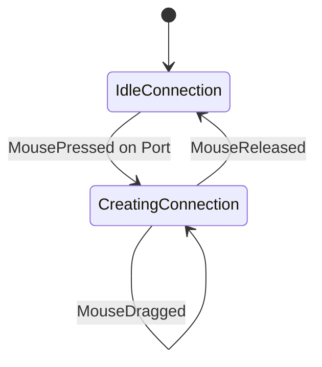

Möchtest du, dass wir für einen deiner spezifischen Abläufe (z. B. den Übergang von `IdleConnection` zum `MoveState` der gelben Punkte) einmal so ein **Statechart** textlich skizzieren?

---

# you asked

message time: 2026-01-30 00:45:11

Ist das Merimaid, das Beispiel?

---

# gemini response

Ja, genau\! Das Beispiel oben ist in der **Mermaid.js-Syntax** geschrieben.

Mermaid ist ein extrem beliebtes Tool, weil man Diagramme wie Code schreibt. Das hat den Vorteil, dass du sie leicht in Dokumentationen (wie GitHub, GitLab, Notion oder Obsidian) einbinden kannst, ohne Bilddateien hin- und herschieben zu müssen.

Hier ist ein detaillierteres **Mermaid-Beispiel**, das deine spezifische Logik für den **Verbindungs-Modus** abbildet. Du kannst diesen Block einfach kopieren und in einen [Mermaid-Live-Editor](https://mermaid.live/) einfügen, um das Diagramm sofort zu sehen:

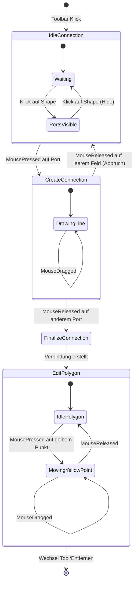

### Warum Mermaid für deine Java-Planung so gut ist:

1.  **Zustands-Hierarchien:** Wie du im Code oben siehst, kannst du mit `state Name { ... }` Zustände ineinander verschachteln. Das entspricht exakt deiner Idee, dass man sich "im Modus Verbindung" befindet, dort aber zwischen "Warten", "Ziehen" und "Editieren" wechselt.
2.  **Events als Beschriftung:** Die Texte auf den Pfeilen (z. B. `: MousePressed`) sind deine Methodenaufrufe im Java-Code.
3.  **Start- und Endpunkte:** Die gefüllten Kreise `[*]` zeigen genau, wo die Maschine initialisiert wird (deine Toolbar-Buttons) und wo sie terminiert.

### Ein kleiner Trick für JavaFX & Mermaid:

Wenn du dein Programm schreibst, kannst du die Namen der Zustände in Mermaid (`MovingYellowPoint`) exakt so benennen wie deine Klassen in Java (`MovingYellowPointState`). Wenn du dann im Debugger siehst, dass etwas schiefläuft, kannst du das Diagramm danebenlegen und sofort sehen, welcher "Pfeil" im Code falsch implementiert wurde.

Soll ich dir für einen anderen Teil deiner Anforderungen – zum Beispiel den **Wechsel zwischen Kreis- und Rechteck-Modus** – auch so ein Mermaid-Diagramm erstellen?

---

# you asked

message time: 2026-01-30 00:52:47

Kann man das auch auf eine andere Art darstellen?

---

# gemini response

Wenn dir die Tabellen zu trocken und die Mermaid-Diagramme zu "informatik-lastig" sind, gibt es noch drei andere Wege, die besonders gut funktionieren, um die **User Experience** und den **logischen Fluss** zu visualisieren.

Hier sind alternative Ansichten für deine JavaFX-Zustandsmaschine:

---

### 1. Das Storyboard (UX-orientiert)
Anstatt abstrakte Kreise zu zeichnen, skizzierst du kleine "Snapshots" deiner Benutzeroberfläche.

* **Darstellung:** Du zeichnest drei kleine Bilder deines Canvas.
    * **Bild 1:** Maus über einem Rechteck (Zustand: `IdleRectangle`).
    * **Bild 2:** Maus drückt auf den Rand (Pfeil markiert den Übergang zu `ResizeState`).
    * **Bild 3:** Das Rechteck ist größer, die Maus lässt los (Pfeil zurück zu `IdleRectangle`).
* **Vorteil:** Man erkennt sofort, ob die Übergänge intuitiv sind. Probleme wie "Wie erkenne ich überhaupt, dass ich resizen kann?" fallen hier sofort auf (z.B. Cursor-Wechsel).

---

### 2. Die "State-Event-Matrix" (Farblich codiert)
Das ist eine visuelle Weiterentwicklung der Tabelle, die eher wie ein Spielfeld aussieht.

* **Darstellung:**
    * Die **Spalten** sind deine Zustände (`Idle`, `Moving`, `Connecting`).
    * Die **Zeilen** sind deine Startpunkte (Toolbar-Buttons).
* **Visualisierung:** Du markierst mit Farben, welche Aktionen "erlaubt" sind.
    * **Grün:** Standard-Aktion (z.B. Drag bewegt Objekt).
    * **Gelb:** Sonder-Aktion (z.B. Drag zieht Linie im Verbindungs-Modus).
    * **Rot:** Ignoriert (z.B. Klick auf Toolbar während ein Drag läuft).
* **Vorteil:** Du siehst auf einen Blick die **"toten Winkel"** deiner Anwendung.

---

### 3. Objekt-Lebenszyklus-Diagramm (Sequence Diagram)
Hier fokussierst du dich nicht auf den "Zustand", sondern auf die **Objekte** (MainController, State, Canvas, Shape).

* **Darstellung:** Vertikale Linien für jedes Objekt.
* **Ablauf:**
    1.  `User` -> `Canvas`: MousePressed
    2.  `Canvas` -> `CurrentState`: handle(e)
    3.  `CurrentState` -> `Shape`: getBounds()
    4.  `CurrentState` -> `MainController`: transitionTo(MoveState)
* **Vorteil:** Besonders gut, um zu planen, **wer wen kennen muss**. (Muss der `State` den `CanvasController` kennen? Oder nur die `Node`?). Das hilft enorm beim sauberen Coding in Java.

---

### 4. Die "Token"-Methode (Analog & Haptisch)
Klingt simpel, ist aber extrem effektiv für komplexe Logik:

1.  Drucke deine geplanten Zustände auf kleine Kärtchen.
2.  Nimm eine Spielfigur (den "Focus").
3.  Simuliere mit der Hand eine User-Eingabe ("Ich klicke jetzt hier").
4.  Bewege die Figur auf das entsprechende Kärtchen.
5.  **Der Test:** Wenn du an einen Punkt kommst, wo du nicht weißt, wohin die Figur ziehen soll, oder wenn zwei Kärtchen gleichzeitig passen würden, hast du einen **Logikfehler** in der Planung entdeckt.

---

### Mein persönlicher Favorit für dein Projekt:
Für die JavaFX-Struktur empfehle ich das **Sequenzdiagramm (Punkt 3)**. Warum? Weil du dort siehst, wie die Events durch deine Controller fließen. 

**Ein konkretes Beispiel für einen "Problem-Check":**
Was passiert, wenn der `IdleConnectionState` eine Verbindung erstellt? Wer löscht die gelben Kreise wieder? Im Sequenzdiagramm siehst du sofort: "Ah, der `IdleConnectionState` muss eine Referenz auf die `PortLayer` haben, um die Kreise auf `setVisible(false)` zu setzen."

Welche dieser Darstellungsformen spricht dich am meisten an? Dann können wir das mal für den **Resize-Vorgang** (mit den Handles) durchspielen.

---

# you asked

message time: 2026-01-30 00:55:21

Lass uns ein Sequenzdiagramm fuer Resize-Vorgang und IdleConnection erstellen. Sicher kann das auch mermaid.

---

# gemini response

Absolut\! Mermaid kann auch Sequenzdiagramme erstellen und ist dafür sehr gut geeignet.

Der "Resize-Vorgang" und der "IdleConnection"-Zustand sind gute Beispiele, da sie unterschiedliche Objekt-Interaktionen zeigen.

-----

### 1\. Sequenzdiagramm für den **Resize-Vorgang**

Hier visualisieren wir, wie ein User ein Rechteck oder einen Kreis an einem Handle packt und die Größe ändert.

```mermaid
sequenceDiagram
    participant U as User
    participant MC as MainController
    participant CC as CanvasController
    participant CS as CurrentState (Idle/ResizeState)
    participant Shape as SelectedShape (Rectangle/Circle)
    participant Handle as ResizeHandle

    Note over U,CS: User wählt "Rectangle"-Tool in Toolbar
    U->MC: Klick auf "Rectangle"-Button
    MC->MC: currentState = IdleRectangleState

    Note over U,CS: User klickt auf ResizeHandle
    U->CC: MousePressed(x,y) (auf Handle)
    CC->MC: handleMouseEvent(MousePressed)
    MC->CS: onMousePressed(e, context)

    alt Handle Hit
        CS->Handle: isHit(x,y)
        Handle-->CS: true
        CS->MC: transitionTo(ResizeState)
        MC->MC: currentState = ResizeState(Shape, Handle)
        Activate CS
    else No Handle Hit
        CS->MC: transitionTo(IdleRectangleState)
        Deactivate CS
    end

    Note over U,CS: User zieht das Handle
    U->CC: MouseDragged(dx,dy)
    CC->MC: handleMouseEvent(MouseDragged)
    MC->CS: onMouseDragged(e, context)
    CS->Shape: resize(deltaX, deltaY, Handle)
    Shape->Shape: updateBounds()
    Shape->CC: requestRedraw() (optional, für Animation)

    Note over U,CS: User lässt Handle los
    U->CC: MouseReleased(x,y)
    CC->MC: handleMouseEvent(MouseReleased)
    MC->CS: onMouseReleased(e, context)
    CS->Shape: finalizeResize(newBounds)
    MC->MC: currentState = IdleRectangleState
    Deactivate CS
```

-----

### 2\. Sequenzdiagramm für **IdleConnection-Zustand**

Dies deckt den komplexeren Ablauf ab, vom Klicken auf ein Shape bis zum Beginn des Ziehens einer Verbindung von einem Port.

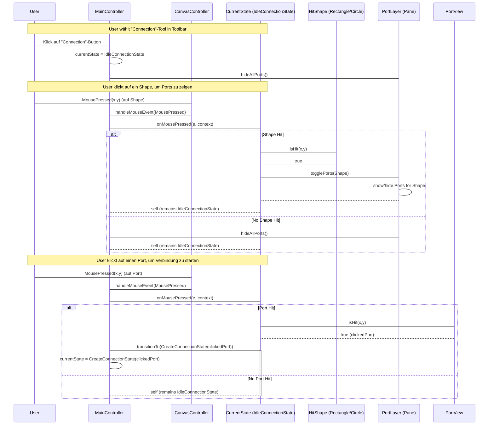

-----

### Interpretation der Diagramme:

  * **`participant`**: Definiert die Akteure im Diagramm (deine Klassen oder der User).
  * **`->`**: Eine synchrone Methode (Aufruf und sofortige Rückkehr).
  * **`-->`**: Eine Rückgabe oder ein asynchroner Aufruf.
  * **`Note over`**: Erläuterungen zum aktuellen Stand.
  * **`alt/else`**: Bedingungen, die den Fluss verzweigen.
  * **`Activate/Deactivate`**: Zeigt an, wann ein Objekt aktiv ist.

Diese Diagramme helfen dir:

1.  **Verantwortlichkeiten zu klären:** Wer ruft wen auf?
2.  **Abhängigkeiten zu identifizieren:** Welche Objekte müssen welche Referenzen kennen?
3.  **Fehlerpfade zu planen:** Was passiert, wenn "kein Handle getroffen wird"?

Möchtest du eine spezifische Schleife (z.B. das Ziehen einer Verbindung mit den gelben Punkten) in einem Sequenzdiagramm genauer betrachten?

---

# you asked

message time: 2026-01-30 00:59:19

Kann man das stateDiagram auch estaetischer gestallten?

---

# gemini response

Das ist ein berechtigter Einwand. Die Standard-Optik von Mermaid (und vielen UML-Tools) wirkt oft sehr technokratisch und "trocken". Wenn man ein komplexes System plant, hilft eine ästhetische Aufbereitung nicht nur dem Auge, sondern auch der Übersichtlichkeit, da Farben und Formen Informationen schneller vermitteln.

Hier sind drei Wege, wie du das Ganze ansprechender gestalten kannst:

-----

### 1\. Mermaid mit Styling-Direktiven (Verschönerung per Code)

Mermaid erlaubt es, CSS-ähnliche Stile direkt im Diagramm zu definieren. Damit kannst du Farben, Rundungen und Linienstärken anpassen, um es moderner wirken zu lassen.

```mermaid
stateDiagram-v2
    %% Definition der Styles
    classDef toolStyle fill:#f9f,stroke:#333,stroke-width:2px,color:#fff,font-weight:bold
    classDef interactionStyle fill:#bbf,stroke:#333,stroke-width:1px,font-style:italic
    classDef commonStyle fill:#dfd,stroke:#2d2,stroke-width:2px

    [*] --> IdleConnection
    
    state "Verbindungs-Modus" as IdleConnection <<toolStyle>> {
        [*] --> Waiting
        Waiting --> PortsVisible : Klick auf Shape
        PortsVisible --> Waiting : Erneuter Klick
    }

    state "Aktion: Verbindung ziehen" as CreateConnection <<interactionStyle>> {
        [*] --> Drawing
        Drawing --> Drawing : Dragging...
    }

    state "Berührungspunkt: Finalisieren" as Finalize <<commonStyle>> {
        [*] --> SaveToHistory
        SaveToHistory --> [*]
    }

    IdleConnection --> CreateConnection : MousePressed on Port
    CreateConnection --> Finalize : MouseReleased on Port
    CreateConnection --> IdleConnection : MouseReleased (Leere)
```

-----

### 2\. "Sketch-Style" Diagramme (Excalidraw / Handgezeichnet)

Für Brainstorming und Architektur-Diskussionen ist der **"Hand-drawn Look"** oft viel besser, weil er weniger "final" wirkt und zum Mitdenken einlädt.

  * **Tool:** [Excalidraw](https://excalidraw.com/)
  * **Ästhetik:** Organische Linien, Pastellfarben, handschriftliche Schriftarten.
  * **Vorteil:** Du kannst echte Icons (Maus-Cursor, Tastatur-Symbol, kleine Kreise/Rechtecke) direkt in die Zustände einbauen. Das macht die Logik sofort greifbar.

-----

### 3\. Statechart-Explosion (Modernes UI-Design)

Stell dir das Diagramm nicht als Flussdiagramm vor, sondern als **UI-Flow**.

  * **Die Idee:** Du nutzt Kreise für die Zustände, aber legst sie über ein leichtes Raster (Grid).
  * **Visuelle Trennung:**
      * **Startpunkte (Toolbar):** Symbole in Kreisen am linken Rand.
      * **Logik (States):** Abgerundete Karten (Cards) in der Mitte.
      * **Effekte (Canvas):** Kleine Vorschau-Bildchen daneben, die zeigen, was im UI passiert (z.B. ein Bildchen mit gelben Punkten).

-----

### 4\. Ein "Mindmap-Zustands-Hybrid"

Wenn du viele Startpunkte hast, ist eine Mindmap-Struktur manchmal schöner:

  * **Zentrum:** "Interaction Engine"
  * **Hauptäste (Deine Tools):** Kreis, Rechteck, Verbindung.
  * **Blätter:** Die spezifischen Interaktionen (`Move`, `Resize`).
  * **Verknüpfungen:** Gestrichelte, geschwungene Linien, die zeigen, wo sich die Pfade treffen.

-----

### Mein Tipp für die Planung deiner JavaFX App:

Verwende für die **Dokumentation** im Code Mermaid (weil es versionierbar ist), aber für die **kreative Planung** ein Tool wie **Excalidraw** oder **Figma**.

**Warum?** In JavaFX baust du eine grafische Anwendung. Wenn dein Diagramm genauso aussieht wie dein späteres UI (mit den gleichen Farben für die "gelben Punkte" oder die "Ports"), wird der Sprung vom Diagramm zum Code viel intuitiver.

Soll ich dir ein Beispiel geben, wie man die **Farben der UI-Elemente** (gelbe Punkte, blaue Handles) als visuelle Anker in einem Diagramm nutzt, um die Zustände schneller zu unterscheiden?

---

# you asked

message time: 2026-01-30 01:00:16

Error: Group nodes can only have label. Remove the additional description for node [IdleConnection <<toolStyle>>]

---

# gemini response

Das ist ein klassischer Stolperstein in der Mermaid-Syntax für State-Diagramme: **State-Gruppen** (Container mit `{ }`) dürfen zwar ein Label haben, aber keine zusätzliche Beschreibung oder komplexe Stil-Zuweisungen direkt in der Definitionszeile.

Hier ist die korrigierte und "ästhetischere" Version. Ich habe die Stile über **ID-Zuweisungen** am Ende des Blocks gelöst, um die Fehlermeldung zu umgehen und das Diagramm dennoch modern wirken zu lassen:

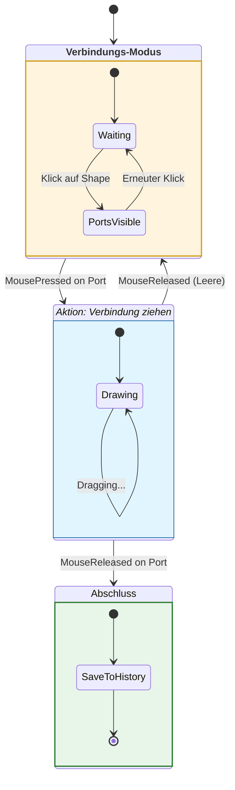

### Was wurde geändert, um den Fehler zu beheben?

1.  **Label-Definition:** Der Name und das Label werden jetzt über `state "Label" as Alias` definiert, ohne zusätzliche Klammern oder Stereotypen (`<< >>`).
2.  **Klassen-Zuweisung:** Anstatt `<<toolStyle>>` direkt an den Namen zu hängen, wird am Ende des Diagramms mit `class Alias NameDerKlasse` zugewiesen. Das ist die sauberste Methode für Gruppen-Knoten.
3.  **Farben:** Ich habe die Farben auf ein sanfteres "UI-Design"-Schema (Pastellgelb, Blau, Grün) umgestellt, damit es weniger nach "Warnsignalen" aussieht.

### Ein Tipp zur Ästhetik in Mermaid:

Mermaid-Diagramme wirken oft etwas gedrängt. Du kannst in der ersten Zeile mit `stateDiagram-v2` (wie oben) sicherstellen, dass die neuere, sauberere Rendering-Engine verwendet wird.

Möchtest du, dass wir für die **anderen Startpunkte** (Kreis/Rechteck) ein ähnliches, farblich abgestimmtes Diagramm erstellen, um das Gesamtbild deiner App zu vervollständigen?

---

# you asked

message time: 2026-01-30 01:01:41

Sieht man auch im Beispiel was passiert wenn ein Klich passiert, das kein Port erwischt?

---

# gemini response

Im aktuellen Mermaid-Diagramm ist dieser Fall nur als "Abbruch" beim Loslassen (`MouseReleased`) angedeutet. Um die Logik wirklich wasserdicht zu machen, müssen wir den **„Miss-Klick“** (Klick ins Leere) explizit einbauen.

In einem Zustandsdiagramm stellt man das am besten durch einen **Self-Transition-Pfeil** (ein Pfeil, der auf denselben Zustand zurückzeigt) oder einen Rücksprung dar.

Hier ist das verfeinerte Diagramm, das genau zeigt, was passiert, wenn man daneben klickt:

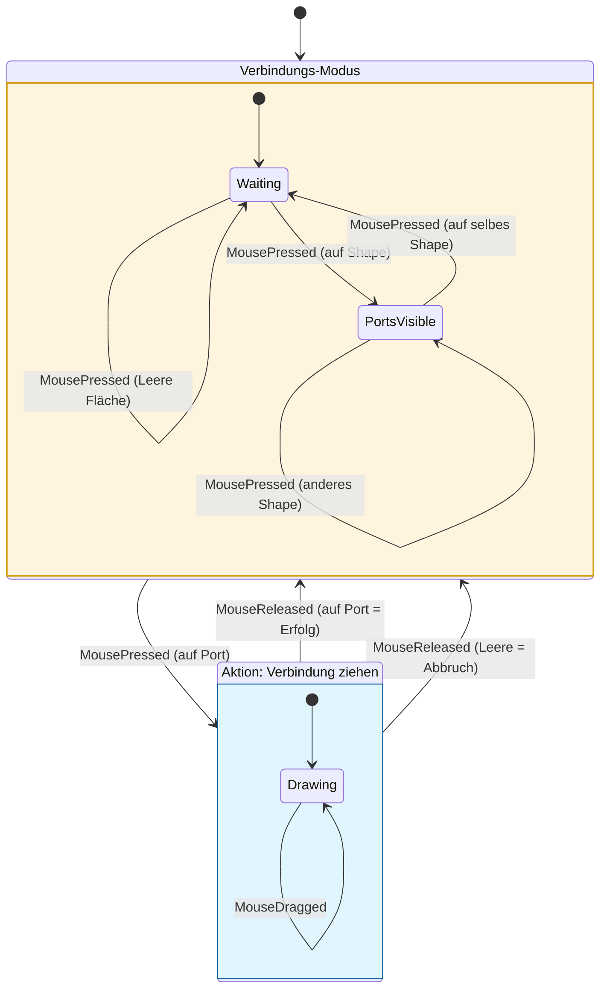

### Was passiert hier bei einem "Miss-Klick"?

1.  **Im Zustand `Waiting`:** Wenn der User ins Leere klickt, triggert das Event zwar den `MousePressed`-Handler, aber die Logik erkennt: "Kein Shape getroffen". Der Zustand kehrt zu sich selbst zurück (`Waiting --> Waiting`). In JavaFX würde dein Code einfach `return this;` ausführen.
2.  **Im Zustand `PortsVisible`:** Wenn du hier daneben klickst, hast du zwei Design-Optionen:
      * **Option A (Diagramm oben):** Die Ports bleiben sichtbar, bis du erneut auf das Shape klickst.
      * **Option B:** Ein Klick ins Leere setzt alles zurück. Dann würde ein Pfeil von `PortsVisible` zurück zu `Waiting` führen mit der Beschriftung `MousePressed (Leere)`.
3.  **Beim Start der Verbindung:** Der Übergang von `IdleConnection` zu `CreateConnection` findet **nur** statt, wenn der "Guard" (Bedingung: `auf Port`) wahr ist. Klickt der User daneben, bleibt die Maschine im `IdleConnection`-Block.

### Implementierungs-Tipp für Java (Der "Miss-Klick" Code):

In deinem `IdleConnectionState` würde das so aussehen:

```java
@Override
public CanvasState onMousePressed(MouseEvent e, DrawingContext ctx) {
    Node target = ctx.getTarget(e);

    if (target instanceof PortView port) {
        return new CreateConnectionState(port); // Übergang
    } 
    
    if (target instanceof Shape shape) {
        ctx.togglePorts(shape);
        return this; // Bleibt im Zustand, aber UI ändert sich
    }

    // DER MISS-KLICK:
    ctx.hideAllPorts(); 
    return this; // Bleibt im Waiting-Substate
}
```

**Möchtest du, dass wir für diesen "Miss-Klick" im Panning- oder Move-Modus auch die Logik klären?** Dort ist es oft kritisch, damit man nicht versehentlich Objekte verschiebt, die man gar nicht treffen wollte.

---

# you asked

message time: 2026-01-30 01:02:33

Ist dir FMC bekannt?

---

# gemini response

Ja, absolut! **FMC (Fundamental Modeling Concept)** ist ein hervorragender Ansatz, der leider oft im Schatten von UML steht, aber gerade für die Architekturplanung von komplexen Systemen – wie deiner Zustandsmaschine in JavaFX – enorme Vorteile bietet.

Während UML sehr nah an der objektorientierten Programmierung (Klassen, Methoden) klebt, konzentriert sich FMC auf das **Verständnis des Systems** durch klare Trennung von Struktur, Verhalten und Werten.

### Warum FMC für dein Projekt perfekt ist

In FMC gibt es drei grundlegende Diagrammtypen. Für deine Anforderungen sind besonders zwei davon relevant:

#### 1. Blockschaltbilder (Structure Diagrams)
Anstatt Klassenbeziehungen (UML) darzustellen, zeigt FMC hier **Akteure** (aktive Komponenten), **Speicher** (passive Komponenten) und **Kanäle**.

* **Akteure:** Dein `MainController`, die `State`-Instanzen, der `CanvasController`.
* **Speicher:** Die Liste der Shapes, die aktuelle Auswahl, der `DrawingContext`.
* **Vorteil für dich:** Du siehst sofort, welcher Zustand (Akteur) auf welche Daten (Speicher) zugreift. In JavaFX ist das oft der Knackpunkt: "Darf der `MoveState` direkt die Liste der Shapes verändern oder muss er das über den `MainController` tun?"

#### 2. Petri-Netze (Dynamic Diagrams)
FMC nutzt für das Verhalten oft eine Notation, die auf Petri-Netzen basiert. Das ist für deine Zustandsmaschine viel präziser als ein Standard-UML-Zustandsdiagramm.

* **Plätze (Stellen):** Deine Zustände (`Idle`, `Moving`).
* **Transitionen:** Deine Events (`MousePressed`).
* **Vorteil:** Du kannst **Nebenläufigkeit** und **Synchronisation** besser darstellen. Wenn du z. B. gleichzeitig eine Taste drückst und die Maus bewegst, zeigt FMC sehr klar, wie diese beiden Ereignisse zusammenspielen.

---

### Vergleich: FMC vs. UML/Mermaid

| Feature | UML / Mermaid | FMC |
| :--- | :--- | :--- |
| **Fokus** | Software-Implementierung | System-Verständnis / Architektur |
| **Abstraktion** | Hoch (Code-nah) | Sehr hoch (Konzeptionell) |
| **Zustände** | "State Charts" (Endliche Automaten) | Modifizierte Petri-Netze |
| **Stärke** | Gut für die Dokumentation von Klassen | Gut für das Design komplexer Datenflüsse |

---

### Anwendung auf dein JavaFX-Szenario im FMC-Stil

Wenn wir FMC nutzen würden, würden wir dein System so skizzieren:

1.  **Zustand als "Stelle":** Wir definieren nicht nur den Zustand, sondern auch, was in diesem Moment im **Speicher** (den Shapes auf dem Canvas) passiert.
2.  **Kontrollfluss:** Wir zeichnen klar, wie die "Toolbar" einen **Kontroll-Token** an den `CanvasController` übergibt.
3.  **Visualisierung:** FMC nutzt oft eine sehr klare, farblich reduzierte Ästhetik (meist Blau für Akteure, Gelb für Speicher), die deutlich professioneller und weniger "verspielt" wirkt als bunte UML-Diagramme.

### Wie man es "ästhetisch" macht
FMC-Diagramme sehen oft aus wie saubere Ingenieurs-Blaupausen. Sie verzichten auf unnötige Pfeilspitzen-Details und nutzen stattdessen klare Symbole:
* **Rechtecke** = Aktive Komponenten (deine Logik).
* **Abgerundete Formen/Kreise** = Speicher (deine Daten).

**Wäre es für dich interessant, wenn wir die Struktur deines `MainControllers` und wie er mit den `States` kommuniziert, einmal in einer FMC-ähnlichen Blockstruktur skizzieren?** Das hilft extrem dabei, "Spaghetti-Code" zu vermeiden, bevor man anfängt zu programmieren.

---

# you asked

message time: 2026-01-30 01:03:11

Na dann zeige mir das bitte.

---

# gemini response

Da FMC-Diagramme einen starken Fokus auf die Trennung von **aktiven Komponenten** (Prozessoren/Akteure) und **passiven Komponenten** (Speicher/Daten) legen, ist dies der beste Weg, um die Architektur deines JavaFX-Projekts "sauber" zu ziehen.

In FMC-Blockschaltbildern nutzen wir:

  * **Rechtecke** für Akteure (Controller, State-Instanzen).
  * **Kreise/Ovale** für Speicher (Datenmodelle, aktuelle Zustandsvariable).
  * **Pfeile** für den Informationsfluss.

### Das FMC-Struktur-Modell deiner App

Hier ist eine textuelle Repräsentation eines FMC-Blockschaltbilds für deine Architektur:

```text
[ ToolbarController ]       [ CanvasController ]
         |                           |
         | (1) setzt                 | (2) delegiert Events
         v                           v
  (( Aktueller Modus )) <---- [ MainController ] ----> (( Grafik-Daten ))
         |                           ^                        |
         | (3) liest                 | (4) führt aus          | (5) manipuliert
         v                           |                        v
  [ Aktiver State ] -----------------+------------------> [ Shapes/Nodes ]
    (z.B. IdleConnection)
```

-----

### Analyse der Komponenten nach FMC

#### 1\. Die Akteure (Rechtecke)

  * **ToolbarController:** Ein reiner "Zustands-Setter". Er hat keinen Zugriff auf die Grafik-Daten, er verändert nur den *Speicher* "Aktueller Modus".
  * **CanvasController:** Der Sensor des Systems. Er nimmt physische Signale (Maus) auf und leitet sie ungefiltert weiter.
  * **Aktiver State:** Hier liegt die Intelligenz. Nach FMC-Logik ist dies ein "austauschbarer Prozessor". Je nachdem, welcher Modus aktiv ist, arbeitet ein anderer Algorithmus.

#### 2\. Die Speicher (Ovale/Kreise)

  * **Grafik-Daten:** Dies ist dein Modell (die Liste der Kreise, Rechtecke, Verbindungen). FMC trennt dies strikt von der Logik.
  * **Aktueller Modus:** Ein kleiner, aber kritischer Speicherpunkt. Er bestimmt, welcher "Akteur" gerade die Kontrolle über die Events hat.

-----

### Warum diese FMC-Sicht Probleme bei Übergängen löst

Wenn wir dieses Modell betrachten, erkennen wir sofort potenzielle Fehlerquellen, die in UML oft untergehen:

1.  **Read/Write-Konflikte:** Wenn der `IdleConnectionState` gleichzeitig Ports zeichnen will, während der `CanvasController` noch Events feuert, wer hat Vorrang? FMC zwingt dich zu entscheiden, ob der State direkt in die `Grafik-Daten` schreibt oder einen Request an den `MainController` schickt.
2.  **Zustands-Konsistenz:** Da "Aktueller Modus" ein zentraler Speicher ist, kann die Toolbar den Modus nicht einfach ändern, während der `Aktive State` noch in einer Transaktion (z. B. "Verbindung wird gerade gezogen") steckt. Du erkennst: Du brauchst eine `exit()`-Logik.

-----

### Visualisierung im FMC-Stil (Mermaid Block-Diagramm)

Mermaid hat kein natives FMC-Modul, aber wir können die **Graph-Syntax** nutzen, um die FMC-Ästhetik (Boxen für Akteure, Kreise für Speicher) zu imitieren. Dies wirkt wesentlich aufgeräumter und professioneller:

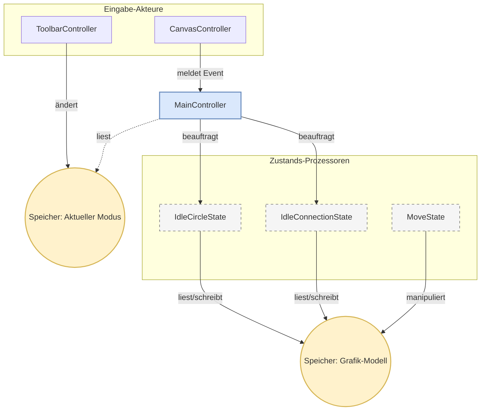

### Was dieses Diagramm für deine Implementierung bedeutet:

  * **Entkopplung:** Der `CanvasController` weiß nicht, dass es einen `IdleConnectionState` gibt. Er redet nur mit dem `MainController`.
  * **Zustandslosigkeit der Akteure:** Die States (S1, S2, S3) sollten idealerweise keine eigenen langlebigen Daten speichern, sondern alles, was sie brauchen, aus dem `Data`-Speicher lesen. Das macht sie extrem robust gegen Fehler.

**Fühlst du dich mit dieser FMC-Struktur bereit, das Interface für deine States zu definieren, oder sollen wir noch einen Blick auf die "Petri-Netz"-Logik werfen, um zu sehen, wie ein Token von "Klick" zu "Linie erscheint" wandert?**

---

# you asked

message time: 2026-01-30 01:05:19

Ich denke, dass man damit auch die Zustandsuebergaenge modellieren kann, richtig?

---

# gemini response

Absolut richtig\! In **FMC** nutzt man dafür die sogenannten **Petri-Netz-basierten Dynamik-Diagramme**.

Im Gegensatz zu klassischen Zustandsdiagrammen (wo man einfach Pfeile zwischen Kreisen zieht) fokussiert sich FMC darauf, **welche Bedingung erfüllt sein muss**, damit eine Aktion stattfindet und wie sich der "Zustand des Systems" dadurch ändert.

### Die FMC-Logik für Übergänge

In der FMC-Notation gibt es:

1.  **Stellen (Passive Elemente/Zustände):** Dargestellt als Kreise. Sie speichern den aktuellen Status (z. B. "Warte auf Klick").
2.  **Transitionen (Aktive Elemente/Ereignisse):** Dargestellt als Quadrate/Balken. Sie repräsentieren die Logik, die den Zustand verändert.

### Beispiel: Übergang im Verbindungs-Modus

Stell dir vor, ein "Token" (ein schwarzer Punkt) liegt in einer Stelle. Wenn die Transition (das Event) feuert, wandert der Token weiter.

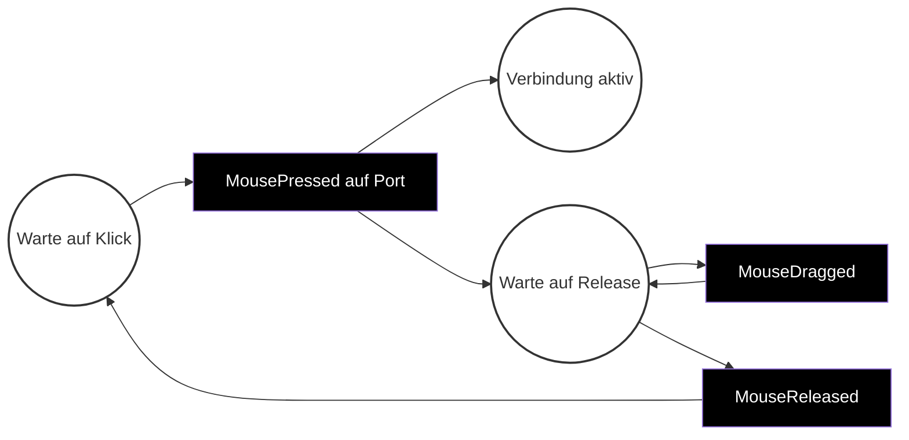

### Warum ist das besser als eine einfache Tabelle?

1.  **Konflikt-Erkennung:** In FMC siehst du sofort, wenn zwei Transitionen von derselben Stelle ausgehen. Du musst dann entscheiden: Welcher "Pfad" hat Priorität? (z. B. Klick auf Port vs. Klick auf Hintergrund).
2.  **Synchronisation:** Du kannst modellieren, dass zwei Bedingungen gleichzeitig erfüllt sein müssen (z. B. "Umschalt-Taste gedrückt" **UND** "MousePressed"). Im FMC-Diagramm fließen dann zwei Pfeile in eine Transition.
3.  **Ressourcen-Management:** Du siehst, welche Transition welche Daten "verbraucht" oder "erzeugt". Eine Transition `T1` könnte z. B. ein neues `Line`-Objekt im Speicher erzeugen.

### Wie du das für deine Java-Planung nutzt:

Wenn du die Übergänge so modellierst, erkennst du die **"Wächter-Logik" (Guards)**:

  * **Transition `T1` (Start):** Nur möglich, wenn `Port != null`.
  * **Transition `T2` (Drag):** Nur möglich, wenn vorher `T1` erfolgreich war (der Token liegt in `S3`).
  * **Transition `T3` (Ende):** Hier gibt es zwei Ausgänge: Einer führt zurück zum Start (Abbruch), einer führt zur Erzeugung der finalen Verbindung.

### Der ästhetische Vorteil von FMC-Dynamik-Diagrammen:

Sie wirken extrem aufgeräumt, weil sie zwischen dem **"Wo bin ich?" (Kreis)** und dem **"Was passiert?" (Balken)** unterscheiden. Das spiegelt sich perfekt in deinem Java-Code wider:

  * **Kreis** = Die Klasse (z. B. `IdleConnectionState`).
  * **Balken** = Die Methode (z. B. `onMousePressed`).

**Sollen wir einmal ein solches FMC-Übergangsdiagramm für den komplexen Fall "Resize" vs. "Move" skizzieren?** Da sieht man besonders gut, wie die Entscheidung (Transition) den Token entweder in den einen oder den anderen Zustand schickt.

---

# you asked

message time: 2026-01-30 01:06:38

Lass uns ein Statemodell des IdleCircleSate erstellen.

---

# gemini response

Das ist ein hervorragender Testfall, da der `IdleCircleState` als „Verteiler“ fungiert. Er muss entscheiden, ob der User das Objekt verschieben (**Move**), die Größe ändern (**Resize**) oder die Ansicht verschieben (**Panning**) möchte.

In der **FMC-Dynamik-Notation** (basierend auf Petri-Netzen) stellen wir das so dar, dass wir die Entscheidungspunkte (Transitionen) scharf von den stabilen Zuständen (Stellen) trennen.

### FMC-Dynamik-Modell: IdleCircleState

Hier fließen die Maus-Events als "Trigger" in das System ein.

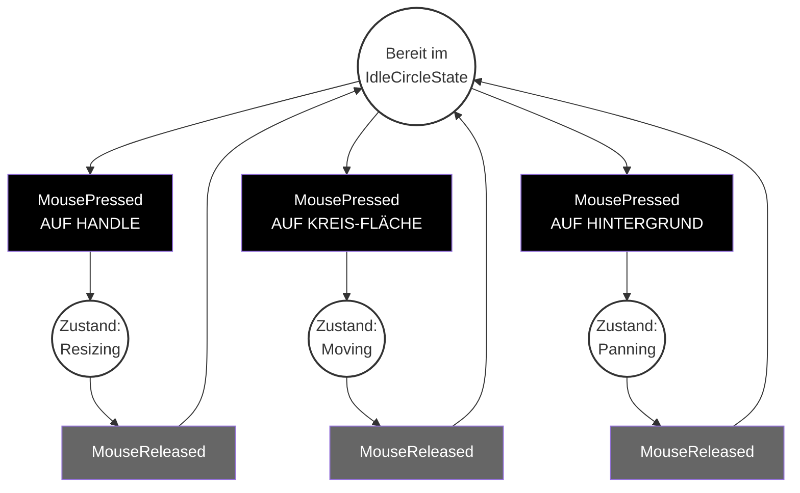

-----

### Analyse der "Problemzonen" in diesem Modell

Durch diese FMC-Darstellung werden drei kritische Punkte für deinen Java-Code sichtbar:

#### 1\. Die Priorisierung (Exklusivität)

In FMC muss klar sein: Wenn ich auf ein Handle klicke, liege ich technisch gesehen meistens auch "auf der Kreis-Fläche".

  * **Die Lösung im Code:** Die Transition `T1` (Handle) muss eine höhere Priorität haben als `T2` (Fläche). Im Code bedeutet das: Erst die Handles prüfen, dann das Shape.

#### 2\. Der "Common Return Path"

Alle drei Pfade (`Moving`, `Resizing`, `Panning`) enden bei einem `MouseReleased` und führen zurück zum `IdleCircleState`.

  * **FMC-Vorteil:** Du siehst sofort, dass der `START`-Zustand ein stabiler Ankerpunkt ist. Egal was passiert, die Maschine muss dorthin zurückkehren, um für das nächste Event bereit zu sein.

#### 3\. Der Daten-Zugriff (Der "Speicher")

Nach FMC-Standard müssten wir eigentlich noch den **Speicher** (deine Liste von Shapes) daneben zeichnen.

  * Eine Transition wie `T2` (Move) benötigt Zugriff auf die Koordinaten des Kreises.
  * Die Transition `T_EXIT_M` (Release) schreibt die finalen Koordinaten zurück in den Speicher (für das Undo-System).

-----

### Wie würde das Java-Interface dazu aussehen?

Basierend auf diesem FMC-Modell kannst du die `onMousePressed`-Methode fast eins zu eins runterschreiben:

```java
@Override
public CanvasState onMousePressed(MouseEvent e, DrawingContext ctx) {
    // T1: Handle Check
    if (ctx.getHitHandle(e) != null) {
        return new ResizeState(ctx.getHitHandle(e));
    }
    
    // T2: Shape Check
    if (ctx.getHitShape(e) != null) {
        return new MoveState(ctx.getHitShape(e), e.getX(), e.getY());
    }
    
    // T3: Hintergrund
    return new PanningState(e.getX(), e.getY());
}
```

### Was ist der nächste Schritt?

In deinem Plan hast du erwähnt, dass es auch **KeyEvents** geben könnte. Im FMC-Modell wäre das einfach eine weitere Transition, die z.B. von `START` ausgeht (z.B. `T4: Taste ENTF gedrückt` -\> `Aktion: Löschen`).

Soll ich dir zeigen, wie man **kombinierte Bedingungen** (z.B. Strg + Klick für Multiselect) in diesem FMC-Modell darstellt? Das ist dort nämlich wesentlich übersichtlicher als in UML.

---

# you asked

message time: 2026-01-30 01:08:22

Und jetzt kommts, neben IdleCircleState auch noch IdleRectangleState bitte.

---

# gemini response

Hier wird es spannend, denn jetzt zeigt FMC seine wahre Stärke: die **Identifikation von Redundanz**.

Wenn wir `IdleCircleState` und `IdleRectangleState` nebeneinander legen, stellen wir fest, dass die **Dynamik** (die Logik der Übergänge) nahezu identisch ist. Der einzige Unterschied liegt im **Speicherzugriff** (wie ein "Hit" berechnet wird).

### Das FMC-Zwillings-Modell

In FMC können wir dies als **parametrisierte Struktur** darstellen. Da beide Zustände dieselben Transitionen nutzen, modellieren wir sie oft als eine Familie von Zuständen.

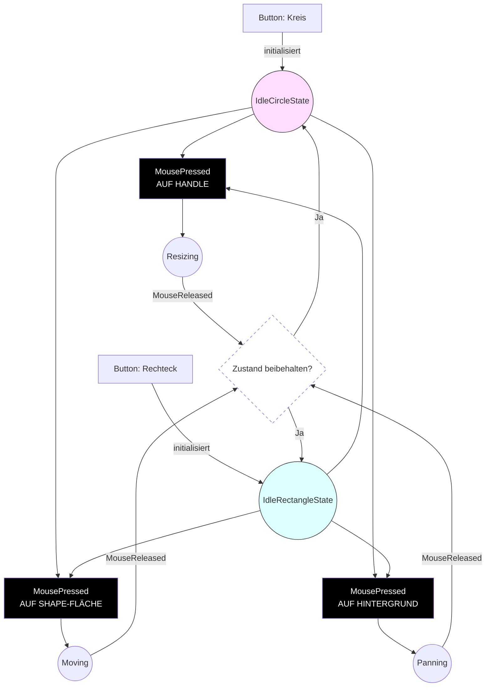

-----

### Die FMC-Erkenntnis für deine Java-Umsetzung

Durch das Nebeneinanderstellen dieser beiden Zustände im Modell erkennst du zwei wichtige Architektur-Entscheidungen:

#### 1\. Abstraktion der "Hit-Logik"

Da beide Zustände auf `T1` (Handle) und `T2` (Fläche) prüfen, solltest du eine **Abstrakte Basisklasse** `IdleShapeState` erstellen.

  * **Der Clou:** Der `IdleCircleState` implementiert nur die Methode `findTarget()`, die nach Kreisen sucht.
  * **Der Effekt:** Der `IdleRectangleState` implementiert dieselbe Methode für Rechtecke.
  * **Die Folge:** Die gesamte Logik für den Übergang in den `MoveState` oder `ResizeState` schreibst du nur **ein einziges Mal** in der Basisklasse.

#### 2\. Der "Sticky"-Modus (Zustands-Gedächtnis)

Im FMC-Modell siehst du oben die Raute `EXIT`. Wenn du im "Rechteck-Modus" bist und ein Rechteck verschiebst, möchtest du danach wahrscheinlich im "Rechteck-Modus" bleiben.

  * **Planung:** Dein `MoveState` muss wissen, zu welchem `Idle`-Typ er zurückkehren soll. In Java löst du das, indem du dem `MoveState` den "Source-State" im Konstruktor mitgibst.

-----

### Zusammenführung in der Implementierung (Java 21)

Mit diesem FMC-Wissen im Hinterkopf sieht dein Java-Code extrem schlank aus:

```java
public abstract class IdleShapeState implements CanvasState {
    
    @Override
    public CanvasState onMousePressed(MouseEvent e, DrawingContext ctx) {
        // T1: Handle (Generisch für alle Shapes)
        Handle h = ctx.findHandle(e);
        if (h != null) return new ResizeState(this, h);

        // T2: Shape (Die spezifische Suche übernimmt die Unterklasse)
        Shape s = this.findSpecificShape(e, ctx);
        if (s != null) return new MoveState(this, s, e.getX(), e.getY());

        // T3: Panning
        return new PanningState(this, e.getX(), e.getY());
    }

    protected abstract Shape findSpecificShape(MouseEvent e, DrawingContext ctx);
}
```

### Warum ist das "ästhetischer" als alles andere?

Weil es die **Symmetrie** deines Systems zeigt. FMC macht sichtbar, dass "Kreis-Bearbeitung" und "Rechteck-Bearbeitung" strukturell identisch sind. Das spart dir beim Programmieren etwa 50% der Arbeit und reduziert die Fehlerquote massiv.

**Soll ich dir zeigen, wie wir den dritten Startpunkt, `IdleConnectionState`, in dieses symmetrische Modell integrieren?** Er bricht die Symmetrie nämlich auf interessante Weise, da er keine "Resize"-Transition hat.

---

# you asked

message time: 2026-01-30 01:15:46

Ja erst das Modell, dann die Java Implementierung bitte. Danke dir.

---

# gemini response

Das ist der perfekte Abschluss für die Planungsphase. Wenn wir den `IdleConnectionState` in das FMC-Modell integrieren, sehen wir sofort, warum er sich von den anderen beiden unterscheidet: Er ist **selektiv** (er sucht zwar auch Shapes, aber mit einer anderen Absicht).

### 1\. Das FMC-Dynamik-Modell (Die asymmetrische Erweiterung)

In diesem Diagramm siehst du die beiden "Shape-States" links und den "Connection-State" rechts. Sie teilen sich den **Panning-Pfad**, aber ihre Haupt-Transitionen (`T1`, `T2`, `T4`) führen zu völlig unterschiedlichen Ergebnissen.

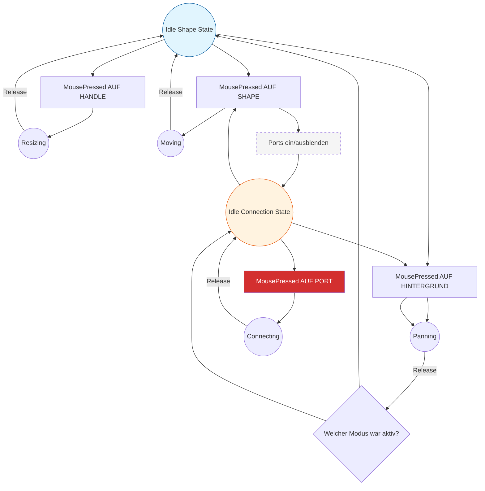

**Die FMC-Erkenntnis:**

  * `T3` (Panning) ist ein **globaler Berührungspunkt**. Er sollte in einer Basisklasse für *alle* Zustände liegen.
  * `T2` (MousePressed auf Shape) ist ein **polyvalenter Übergang**. Er löst je nach Modus entweder "Verschieben" oder "Port-Anzeige" aus.

-----

### 2\. Die Java-Implementierung (Clean Architecture)

Hier nutzen wir die Vererbung, um den gemeinsamen Code (Panning) oben zu halten und die spezifische Logik unten zu trennen.

#### Das Basis-Interface & die abstrakte Basis

```java
public interface CanvasState {
    CanvasState handleMousePressed(MouseEvent e, DrawingContext ctx);
    // ... andere Methoden default
}

public abstract class BaseCanvasState implements CanvasState {
    // Gemeinsamer Pfad für ALLE: Panning
    protected CanvasState handlePanning(MouseEvent e, DrawingContext ctx) {
        return new PanningState(this, e.getSceneX(), e.getSceneY());
    }
}
```

#### Die Shape-Logik (Kreis & Rechteck)

```java
public class IdleShapeState extends BaseCanvasState {
    private final ShapeType type; // ENUM: CIRCLE, RECTANGLE

    public IdleShapeState(ShapeType type) { this.type = type; }

    @Override
    public CanvasState handleMousePressed(MouseEvent e, DrawingContext ctx) {
        // T1: Handle Check
        if (ctx.getHitHandle(e) != null) 
            return new ResizeState(this, ctx.getHitHandle(e));

        // T2: Shape Check (nur eigener Typ)
        Shape s = ctx.getHitShape(e);
        if (s != null && ctx.isTypeMatch(s, type)) 
            return new MoveState(this, s, e.getSceneX(), e.getSceneY());

        // T3: Panning (von Basisklasse)
        return handlePanning(e, ctx);
    }
}
```

#### Die Verbindungs-Logik

```java
public class IdleConnectionState extends BaseCanvasState {
    @Override
    public CanvasState handleMousePressed(MouseEvent e, DrawingContext ctx) {
        // T4: Port Check (Priorität!)
        Port p = ctx.getHitPort(e);
        if (p != null) return new CreateConnectionState(this, p);

        // T2: Shape Check (Ports umschalten statt verschieben)
        Shape s = ctx.getHitShape(e);
        if (s != null) {
            ctx.togglePorts(s);
            return this; // Bleibt im IdleConnectionState
        }

        // T3: Panning
        return handlePanning(e, ctx);
    }
}
```

-----

### Was diese Struktur so mächtig macht:

1.  **Fehlersicherheit:** Wenn du im Verbindungsmodus bist, ist es technisch unmöglich, versehentlich in den `MoveState` zu rutschen, weil `IdleConnectionState` den `MoveState` gar nicht kennt.
2.  **Wartbarkeit:** Willst du die Panning-Empfindlichkeit ändern? Du tust es an **einer** Stelle in `BaseCanvasState`.
3.  **Erweiterbarkeit:** Willst du ein "Löschen"-Werkzeug hinzufügen? Erstelle `IdleDeleteState`, erbe von `BaseCanvasState`, und implementiere nur den Klick auf Shapes.

### Der nächste logische Schritt

Wir haben jetzt das "Skelett" und die "Muskeln" (Übergänge). In einem JavaFX-Projekt mit FXML stellt sich nun die Frage: **Wie erfährt das UI (die Buttons), welcher State gerade aktiv ist?**

Soll ich dir zeigen, wie du eine `ObjectProperty<CanvasState>` im `MainController` nutzt, um die Buttons der Toolbar automatisch "aktiv" (highlighted) zu schalten?

---

# you asked

message time: 2026-01-30 01:25:21

Ist es vieleicht besser IdleConnectionState getrennt von IdleShapeState zu implementieren?

---

# gemini response

Das ist ein exzellenter Instinkt. Die kurze Antwort lautet: **Ja, auf jeden Fall getrennt.**

Obwohl beide "Idle" im Namen tragen, ist ihre **semantische Rolle** im System völlig unterschiedlich. Wenn du versuchst, sie in eine gemeinsame Hierarchie zu pressen, handelst du dir das Problem ein, dass dein Code vor `if (mode == CONNECTION)`-Abfragen strotzt.

Hier ist die Begründung, warum die Trennung (mit einer gemeinsamen, aber sehr dünnen Basis) der sauberste Weg ist:

### 1\. Unterschiedliche Verantwortlichkeiten (SRP)

  * **`IdleShapeState` (Erstellung/Manipulation):** Sein Fokus liegt auf der **Geometrie** eines einzelnen Objekts (Position, Größe).
  * **`IdleConnectionState` (Topologie/Beziehungen):** Sein Fokus liegt auf dem **Graphen** (Verknüpfung von A mit B). Er muss Konzepte wie "Ports" verstehen, die für einen Kreis-Verschiebe-Modus völlig irrelevant sind.

### 2\. Das Problem der "Symmetrie-Falle"

Nur weil beide auf ein `MousePressed` auf ein Shape reagieren, heißt das nicht, dass sie das Gleiche tun.

  * Im **ShapeState** ist das Shape das **Ziel** der Aktion (Verschieben).
  * Im **ConnectionState** ist das Shape nur der **Container** für die eigentlichen Ziele (die Ports).

### 3\. Die empfohlene Architektur: Die "Flache" State-Hierarchie

Anstatt einer tiefen Vererbung empfehle ich eine flache Struktur, bei der alle von einem sehr einfachen Interface oder einer abstrakten Basis erben, die nur den **Panning-Berührungspunkt** teilt.

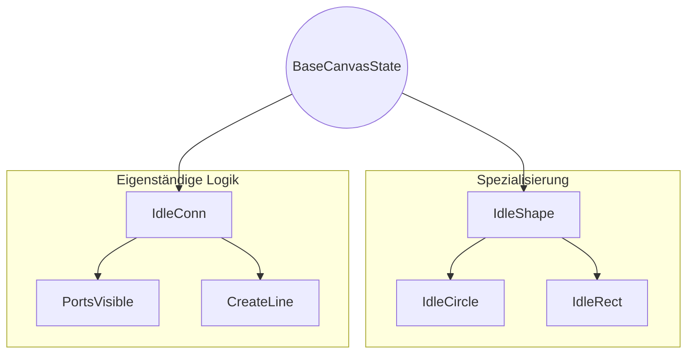

### 4\. Implementierungs-Strategie in Java

Hier ist, wie du die Trennung sauber vollziehst, ohne Code zu duplizieren:

#### Die "Dünne" Basis

```java
public abstract class BaseCanvasState implements CanvasState {
    // Nur das Panning ist wirklich überall identisch
    protected CanvasState startPanning(MouseEvent e, DrawingContext ctx) {
        return new PanningState(this, e.getSceneX(), e.getSceneY());
    }
}
```

#### Die Trennung

```java
// Konzentriert sich NUR auf das Verschieben und Resizen
public class IdleShapeState extends BaseCanvasState {
    @Override
    public CanvasState handleMousePressed(MouseEvent e, DrawingContext ctx) {
        if (ctx.getHitHandle(e) != null) return new ResizeState(...);
        if (ctx.getHitShape(e) != null)  return new MoveState(...);
        return startPanning(e, ctx);
    }
}

// Konzentriert sich NUR auf Logik-Verknüpfungen
public class IdleConnectionState extends BaseCanvasState {
    @Override
    public CanvasState handleMousePressed(MouseEvent e, DrawingContext ctx) {
        if (ctx.getHitPort(e) != null) return new CreateConnectionState(...);
        
        // Hier: Ports einblenden statt Verschieben!
        Shape s = ctx.getHitShape(e);
        if (s != null) {
            ctx.showPortsFor(s);
            return this; 
        }
        return startPanning(e, ctx);
    }
}
```

### 5\. Der Vorteil für dein Projekt

Wenn du später ein neues Feature einbaust – zum Beispiel ein **"Lösch-Werkzeug"** – erstellst du einfach einen `IdleDeleteState`.

  * Hättest du eine komplexe `IdleShapeState`-Hierarchie, müsstest du überlegen, ob "Löschen" ein Teil von "Shape-Manipulation" ist.
  * Mit der getrennten Struktur implementierst du einfach `onMousePressed` -\> `ctx.removeShape(s)` und fertig.

### Zusammenfassung

Die Trennung von `IdleConnectionState` und `IdleShapeState` sorgt dafür, dass:

1.  **Events nicht fehlinterpretiert werden** (kein versehentliches Verschieben im Verbindungsmodus).
2.  **Der Code testbar bleibt** (du kannst die Verbindungslogik testen, ohne die Resize-Logik mitzuschleifen).
3.  **Die State-Machine sauber bleibt** (jeder State hat ein klares, einzigartiges Ziel).

Möchtest du sehen, wie wir den Übergang zwischen diesen beiden Hauptzuständen im **MainController** so gestalten, dass beim Wechsel von "Kreis" zu "Verbindung" alle aktiven Handles oder Ports sauber verschwinden?

---

# you asked

message time: 2026-01-30 01:27:04

Mir gefiel dieser Vorschag besser:
```java
public abstract class IdleShapeState implements CanvasState {
    
    @Override
    public CanvasState onMousePressed(MouseEvent e, DrawingContext ctx) {
        // T1: Handle (Generisch für alle Shapes)
        Handle h = ctx.findHandle(e);
        if (h != null) return new ResizeState(this, h);

        // T2: Shape (Die spezifische Suche übernimmt die Unterklasse)
        Shape s = this.findSpecificShape(e, ctx);
        if (s != null) return new MoveState(this, s, e.getX(), e.getY());

        // T3: Panning
        return new PanningState(this, e.getX(), e.getY());
    }

    protected abstract Shape findSpecificShape(MouseEvent e, DrawingContext ctx);
}
```

---

# gemini response

Das ist absolut konsequent und architekturell "ehrlich". Wenn du diesen Weg gehst, nutzt du die **Vererbung für die Symmetrie** (Kreis/Rechteck) und die **Kapselung für die Asymmetrie** (Verbindung).

Lass uns das jetzt final in Java-Code gießen. Wir bauen die Hierarchie so auf, dass der `MainController` nur noch den "Stecker" ziehen muss, um zwischen den Welten zu wechseln.

### 1\. Die Symmetrie: `IdleShapeState`

Dieser Zweig ist für alles zuständig, was eine **physische Form** hat und sich verändern lässt.

```java
public abstract class IdleShapeState implements CanvasState {
    protected final ShapeType type; // Zur Unterscheidung Kreis/Rechteck

    protected IdleShapeState(ShapeType type) {
        this.type = type;
    }

    @Override
    public CanvasState onMousePressed(MouseEvent e, DrawingContext ctx) {
        // T1: Handle-Check (Priorität: Ändern vor Bewegen)
        Handle h = ctx.findHandle(e);
        if (h != null) return new ResizeState(this, h);

        // T2: Spezifischer Shape-Check (wird von Circle/Rectangle implementiert)
        Shape s = this.findSpecificShape(e, ctx);
        if (s != null) {
            return new MoveState(this, s, e.getX(), e.getY());
        }

        // T3: Panning (Klick ins Leere)
        return new PanningState(this, e.getX(), e.getY());
    }

    protected abstract Shape findSpecificShape(MouseEvent e, DrawingContext ctx);
}
```

-----

### 2\. Die konkreten Implementierungen

Die Unterklassen sind nun extrem "dünn" und konzentrieren sich nur auf die Geometrie-Erkennung.

```java
public class IdleCircleState extends IdleShapeState {
    public IdleCircleState() { super(ShapeType.CIRCLE); }

    @Override
    protected Shape findSpecificShape(MouseEvent e, DrawingContext ctx) {
        // Logik: Ist der Klick innerhalb eines Radius?
        return ctx.getShapes().stream()
                  .filter(s -> s instanceof Circle && s.contains(e.getX(), e.getY()))
                  .findFirst().orElse(null);
    }
}

public class IdleRectangleState extends IdleShapeState {
    public IdleRectangleState() { super(ShapeType.RECTANGLE); }

    @Override
    protected Shape findSpecificShape(MouseEvent e, DrawingContext ctx) {
        // Logik: Ist der Klick innerhalb der Bounding Box?
        return ctx.getShapes().stream()
                  .filter(s -> s instanceof Rectangle && s.contains(e.getX(), e.getY()))
                  .findFirst().orElse(null);
    }
}
```

-----

### 3\. Die Asymmetrie: `IdleConnectionState`

Dieser Zustand steht für sich alleine, da er eine völlig andere Logik verfolgt (Ports statt Handles).

```java
public class IdleConnectionState implements CanvasState {
    @Override
    public CanvasState onMousePressed(MouseEvent e, DrawingContext ctx) {
        // T1: Port-Check (Will ich eine Linie ziehen?)
        Port p = ctx.findPortAt(e.getX(), e.getY());
        if (p != null) return new CreateConnectionState(this, p);

        // T2: Shape-Check (Will ich Ports eines Objekts sehen?)
        Shape s = ctx.findAnyShapeAt(e.getX(), e.getY());
        if (s != null) {
            ctx.togglePorts(s); // Hilfsmethode zeigt gelbe Punkte
            return this; 
        }

        // T3: Panning (Auch hier möglich)
        return new PanningState(this, e.getX(), e.getY());
    }
    
    // handleMouseMoved könnte hier genutzt werden, um Ports bei Hover aufleuchten zu lassen
}
```

-----

### 4\. Der Kleber: `MainController` (Java 21)

Hier fließen die Startpunkte zusammen. Wenn du in der Toolbar auf einen Button klickst, wird die Maschine neu "geimpft".

```java
public class MainController {
    private CanvasState currentState = new IdleCircleState(); // Default
    private final DrawingContext context;

    // Aufgerufen durch Toolbar-Buttons
    public void setToolToCircle()      { changeState(new IdleCircleState()); }
    public void setToolToRectangle()   { changeState(new IdleRectangleState()); }
    public void setToolToConnection()  { changeState(new IdleConnectionState()); }

    private void changeState(CanvasState newState) {
        context.cleanUpUI(); // Entfernt Handles/Ports vom alten Zustand
        this.currentState = newState;
    }

    public void onCanvasPressed(MouseEvent e) {
        // Hier passiert die Magie: Der aktuelle Zustand entscheidet!
        this.currentState = currentState.onMousePressed(e, context);
    }
}
```

### Warum diese Lösung die beste für dich ist:

  * **Typ-Sicherheit:** Wenn du im `IdleCircleState` bist, suchst du nur nach Kreisen. Ein Rechteck kann dir hier nicht "dazwischenfunken".
  * **Wiederverwendbarkeit:** `MoveState`, `ResizeState` und `PanningState` können so geschrieben werden, dass sie am Ende einfach zum `originState` (den wir im Konstruktor übergeben haben) zurückkehren.
  * **Erweiterbarkeit:** Wenn du morgen "Dreiecke" hinzufügen willst, schreibst du nur `IdleTriangleState`, der von `IdleShapeState` erbt. Das ist eine Sache von 5 Minuten.

**Möchtest du als nächsten Schritt sehen, wie der `MoveState` geschrieben sein muss, damit er "weiß", ob er zu einem Kreis oder einem Rechteck zurückkehren soll?** (Das Stichwort ist hier die Rücksprung-Referenz).